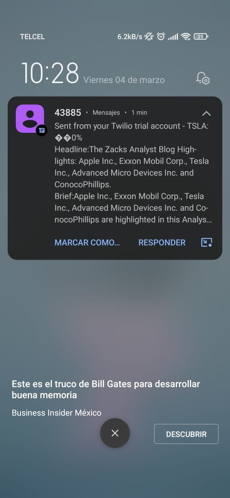

# Stock trading news alert project

Con ayuda de la Api ALPHA VANTAGE y pasando los paramametros correctos se obtuvo las acciones de Tesla en este caso en los ultimos dos días.
Se realizo la comparación y se calculo el porcentaje de variación entre las acciones.

Despues se obtuvieron noticias relacionadas al tema con la ayuda de la API NEWS, se recuperaron solo las primeras 3 noticias.

Finalmente se enviarón los datos obtenidos con ALPHA VANTAGE y las 3 noticias obtenidas con NEWS API en un mensaje de texto gracias la API TWILIO

